# Jarvis Net Tools

**A pocket network lab on a Raspberry Pi.** Plug it in at any site, join the Wi-Fi from your phone, and
see what the network is really doing: signal and channels, devices, live ping / route / port scans, and a
speedometer-style speed test with a bufferbloat grade. Everything is a phone-first web app served by the Pi itself.

> **Look, don't reuse.** This repository is published so you can read how it works. It is **not open source**:
> you may not copy, reuse, modify or run the code without permission. See [`LICENSE`](LICENSE).
> Want to use or collaborate on it? Ask first (GitHub profile **X4Applegate**).

<p align="center">
  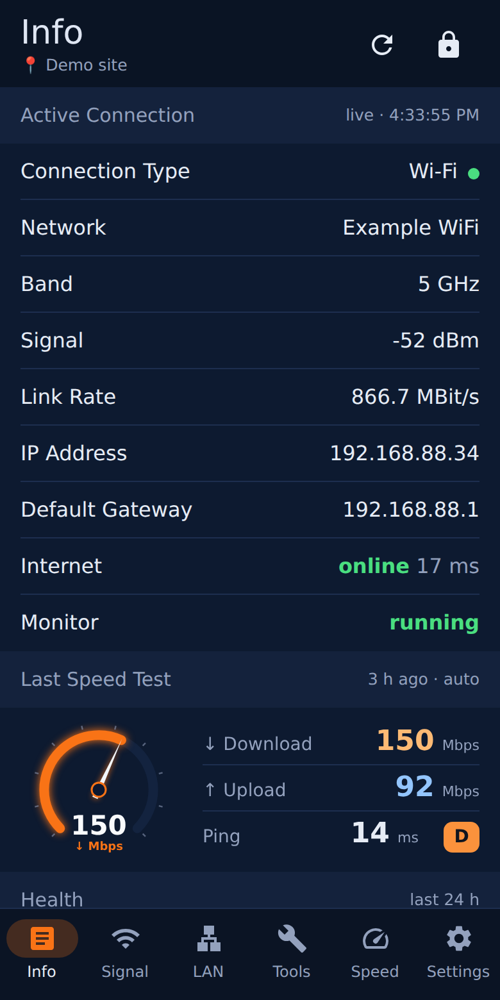
  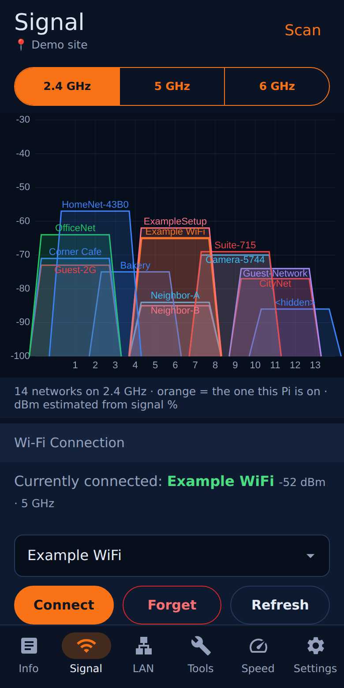
  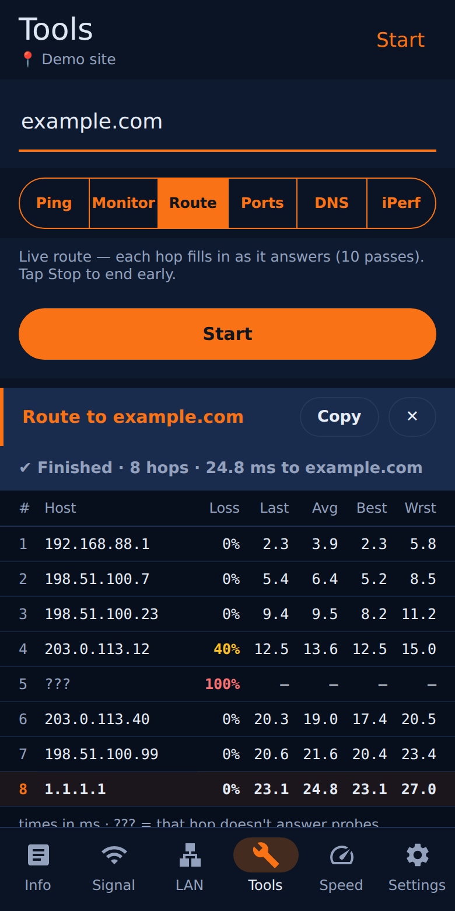
  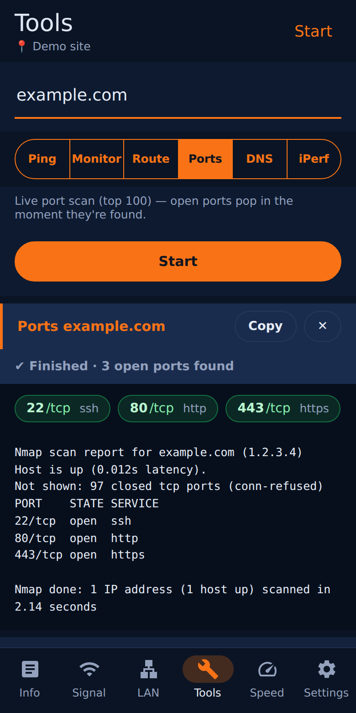
</p>
<p align="center">
  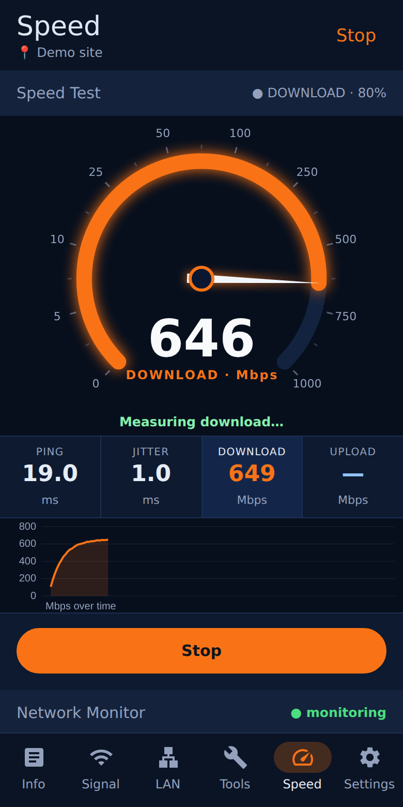
  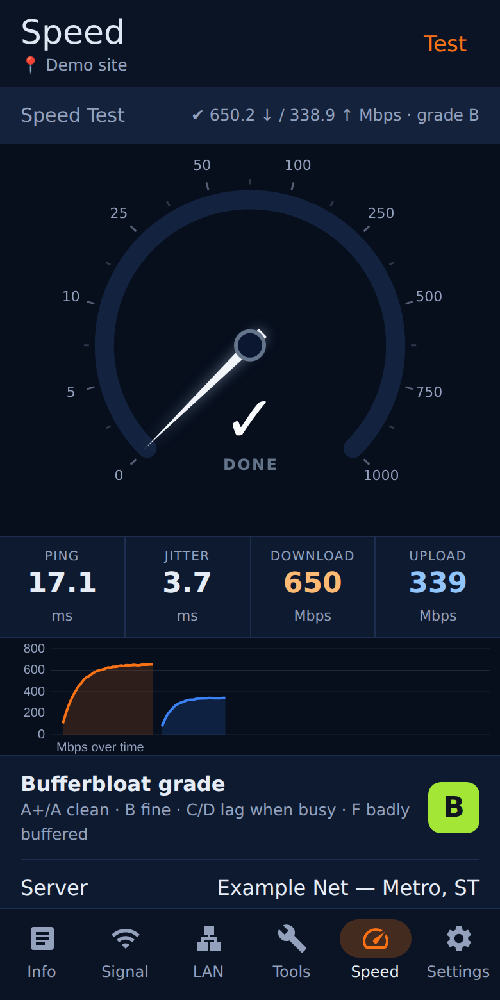
  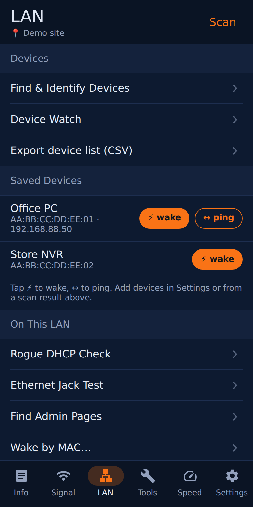
</p>
<sub>Screenshots are generated from a mock API with fictional data (`dev/ui-tests`).</sub>

## What it does

| Tab | Highlights |
|---|---|
| **Info** | Connection type, SSID, band, signal, link rate, the Wi-Fi adapter's **USB link** (warns when a USB 3 adapter fell back to USB 2), IP and gateway; internet/monitor state; 24 h uptime and outages; a mini gauge with the last speed test; a **power button** (shut down / restart, with a confirm step). |
| **Signal** | Live Wi-Fi **channel graph** (2.4 / 5 / 6 GHz), join networks, pick a specific access point (BSSID) and band, watch roaming. |
| **LAN** | Find and identify devices (ARP + port/mDNS/SSDP fingerprints), device watch, saved devices with Wake-on-LAN, rogue-DHCP check, Ethernet jack test (link, DHCP, LLDP/CDP switch and port, VLAN tags). |
| **Tools** | **Live ping**, continuous ping monitor, **live route** (hop table), **live port scan**, DNS, iperf3 — results appear in a card right under the thing you tapped. |
| **Speed** | A **speedometer** with an eased needle, ping/jitter/download/upload tiles, a Mbps-over-time trace, a **bufferbloat grade** (latency under load), history charts and an outage timeline. |
| **Settings** | Site name, scheduled speed tests, **setup hotspot Off / Auto / On**, custom service checks, saved devices, password, display mode, **history since / Clear History Now**, safe shutdown. |

Also: a background **network monitor** (internet / gateway / DNS samples, outage log, scheduled speed tests), a printable
**site report**, an optional **Cockpit** page, an optional **setup hotspot with a captive page** for joining Wi-Fi from a phone
(on **Auto** it stays off while the Pi has a network and turns itself on after 2 minutes without one),
a **fresh history at every power-on** (a restart keeps it) so each site report covers one visit,
and a small **agent API** (hashed, scoped bearer tokens) so other automations can read the Pi's state.

## How it is built (the interesting parts)

- **Live tools over Server-Sent Events.** `POST /api/ping|trace|portscan|speedtest/stream` start a process on the Pi and push
  every output line to the phone the moment it appears. A once-a-second `: keepalive` comment means a closed phone connection
  is noticed immediately and the process is killed. The phone parses the events and draws: latency bars for ping, a **hop table
  built from `mtr --raw` events**, open-port chips from `nmap -v`, and the speedometer from the Ookla CLI's `jsonl` progress.
- **The speedometer is one canvas renderer** shared by the big dial and the small one on the Info page: a non-linear 0-1000 Mbps
  scale, the needle eased toward the live value, and glow/colour per phase (cyan ping, orange download, blue upload).
- **Results on the page, not in a console.** One `runLive()` / `show()` pipeline places a result card under the tapped section,
  keeps live updates on the page they started from, and falls back to the old one-shot endpoints if a Pi is running an older build.
- **A tiny root helper instead of a wide sudoers file.** The app runs unprivileged; `scripts/jarvis-priv` is the only scanner/sniffer
  entry in sudoers and validates every argument (details in [`SECURITY.md`](SECURITY.md)).
- **No build step, no front-end dependencies**: plain HTML, CSS and JavaScript (inline SVG icons, canvas charts), a Flask backend
  and a service worker that is network-first.
- **Tested without a Pi.** `dev/ui-tests` runs Playwright against a mock of the Pi API (including streaming look-alikes and
  canvas-pixel checks that the needles really move); `dev/security-tests` checks the backend's auth, throttle, headers and the
  root helper's allow/deny lists.

## Hardware notes

Developed on a Raspberry Pi 4, now a Raspberry Pi 5, with a USB 3 Wi-Fi 6E adapter as the primary radio and the built-in radio
for a setup hotspot. Lessons that cost real time: the adapter must enumerate at USB 3 (5000 M; at USB 2 it caps near
150 Mbit/s) and some USB-C cables only reach USB 3 in one plug orientation; a Pi 5 needs a supply that offers 5 V / 5 A
(on a 3 A source it throttles under load); turn Wi-Fi power save off; and the Wi-Fi link rate is a raw rate — expect a
fraction of it in practice.

### Hardware used

| Part | What | Notes |
|---|---|---|
| Computer | **Raspberry Pi 5 Model B, 8 GB** (CanaKit Raspberry Pi 5 Starter Kit PRO) | Raspberry Pi OS Lite 64-bit (Debian 13), boots from NVMe; the kit's microSD stays as a fallback |
| Case | **SunFounder Pironman 5 Pro Max** | 4.3" 800x480 DSI touch screen (runs the app), 0.96" OLED status screen, tower cooler + 2 fans, power button, dual-NVMe board; case software: `extras/pironman5/` |
| Storage | **Samsung 960 EVO 500 GB** NVMe SSD | boot disk |
| Wi-Fi (tests) | **ALFA Network AWUS036AXML** - Wi-Fi 6E (802.11axe), AXE3000, 2.4 / 5 / 6 GHz, USB 3.0 | MediaTek MT7921AU (`mt7921u` driver, in the kernel). On Linux it uses up to 80 MHz channels, so the link tops out near 1.2 Gbit/s; must enumerate at USB 3 (5000 M) |
| Wi-Fi (setup hotspot) | the Pi's built-in radio (Wi-Fi 5) | only on when needed (Settings > Setup Hotspot) |
| Power at the desk | **5.1 V / 5 A USB-C PD** supply (Pi 5 type) | 27 W+ supplies that offer 5 V / 5 A; a 5 V / 3 A source makes the Pi throttle under load |
| Power on the go | USB-C power bank (Anker) | works, but offers only 5 V / 3 A to the Pi; a Pi-5 UPS with a 5 V / 5 A output is the better fit |
| Cables | short **USB-A to USB-C 10 Gbps** cable for the adapter; **5 A (e-marked) USB-C** cable for power | some USB-C cables reach USB 3 in one plug orientation only |

Measured with this setup (business cable line, 5 GHz, Ookla): **775 / 340 Mbps** on the 5 A supply, **734 / 354 Mbps** on
the power bank; a Wi-Fi 7 laptop on the same access point did 682 / 342.

### The tester (photos)

A Raspberry Pi 5 in a case with a 4.3" touch screen, the USB Wi-Fi 6E adapter on top, running from a USB-C power bank. The
screen boots straight into the app (`kiosk/`: a Wayland kiosk with an on-screen keyboard; it turns off after 30 minutes
without a touch). Private network details in the photos are blurred.

<p>
  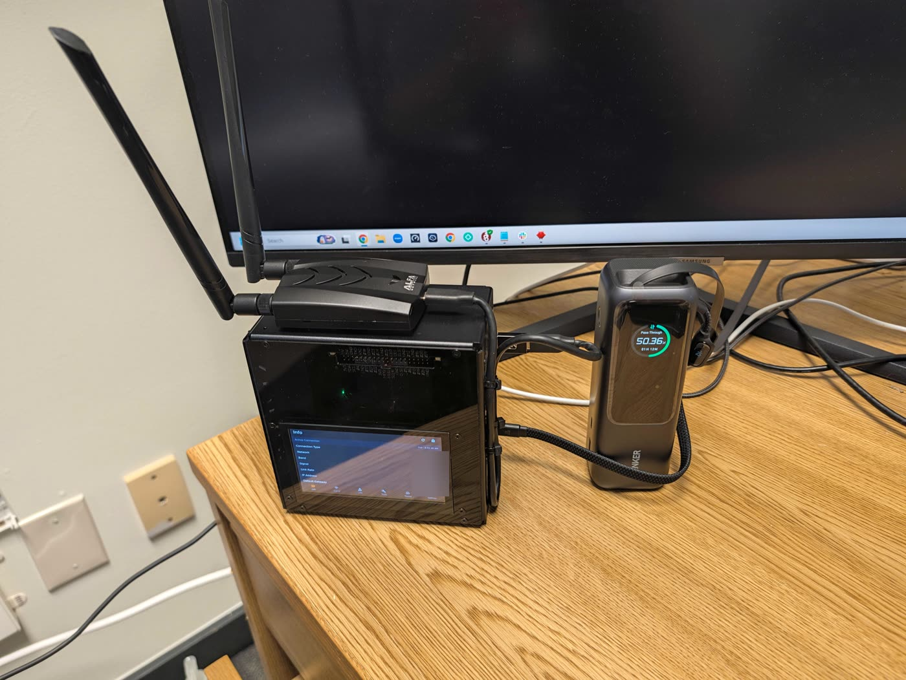
  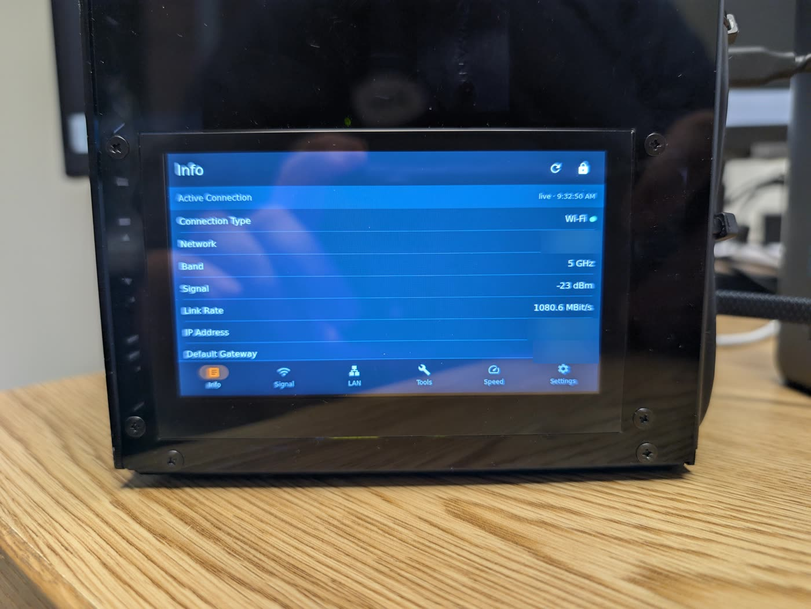
  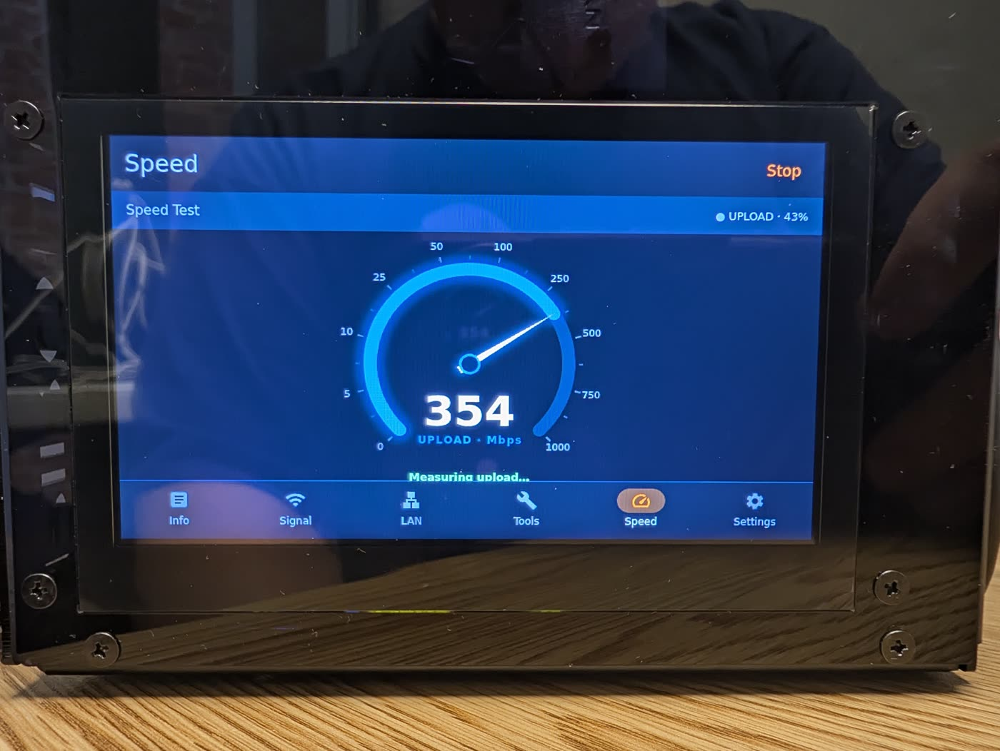
</p>
<p>
  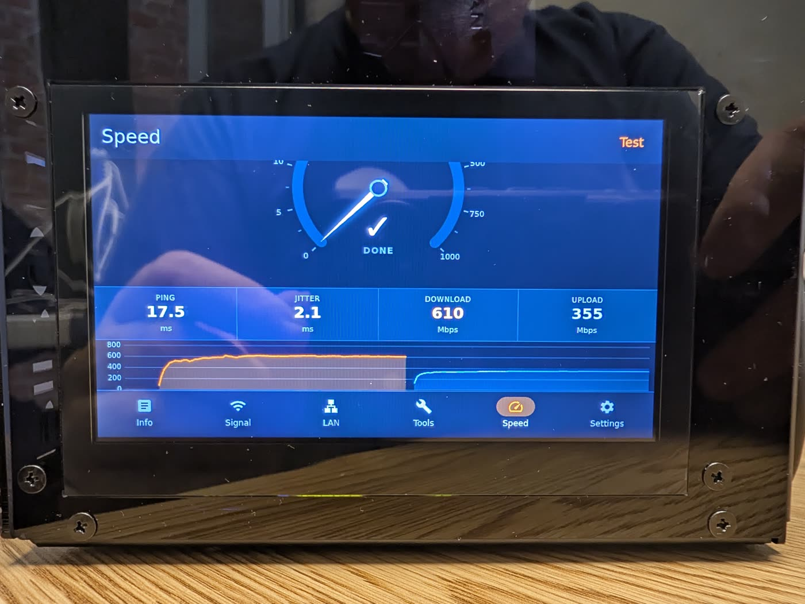
  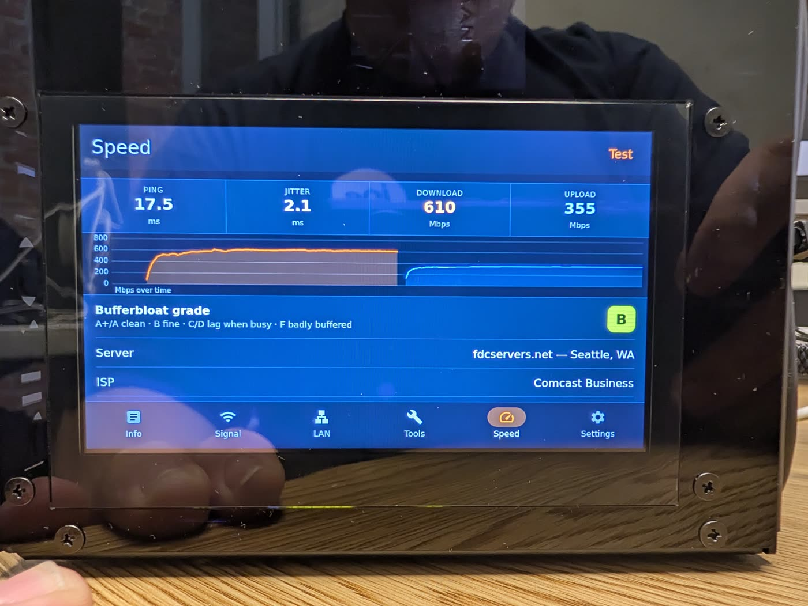
  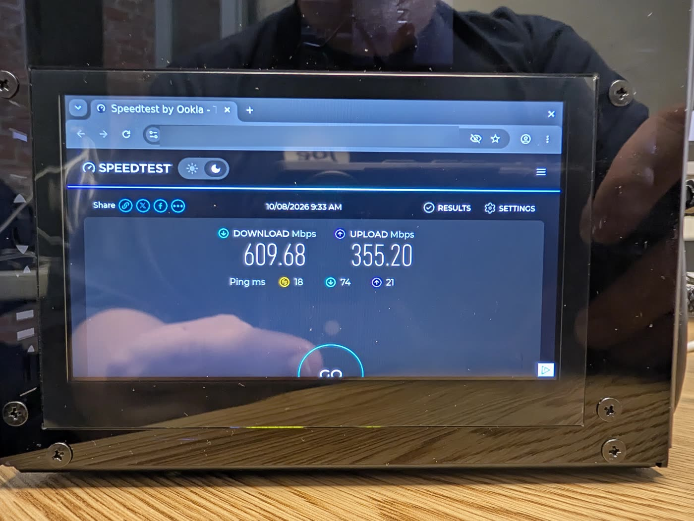
</p>

## Security

One app password (scrypt hash), login throttling, a minimal sudo surface, strict CSP and cookie flags, and VPN-only by design.
See [`SECURITY.md`](SECURITY.md) for the model, known limits and how to report a problem privately.

## Layout

```
app/            Flask backend (app.py), auth helpers, network monitor, front end in app/static/
scripts/        root helper (jarvis-priv), wifi-clear, token tool, deploy helpers
splash/ systemd/ udev   optional setup hotspot, captive page and service units (placeholders, not for copying as-is)
cockpit-nettools/       optional Cockpit page
kiosk/          touch-screen kiosk for the Pi's own display (labwc + Chromium app window + on-screen keyboard)
extras/pironman5/  Pironman 5 Pro Max case software (SunFounder's installer, patched for the kiosk) + a firewall rule
                   that keeps the case's login-less dashboard on loopback / the VPN only
dev/            mock Pi API + Playwright UI suites, backend security tests
docs/screenshots/ docs/photos/   images used above (photos: metadata stripped, private details blurred)
```

## License and credits

View-only license: [`LICENSE`](LICENSE). Third-party notices (Material Design icons under Apache-2.0, external tools) are in
[`NOTICE.md`](NOTICE.md). Built by Richard Applegate (**X4Applegate**) together with his AI coding assistant, **Jarvis AI Agent**.
